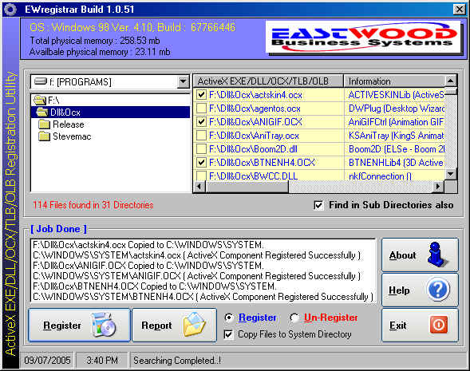



## EWregistrar V\.1\.0

### Description

Search and Register / Unregister ActiveX EXE / DLL / OCX / OLB / TLB from within one UI.

This is Update to my first submission of EWRegister V.1.0 to PSC. In this version, Registry Clean-up is taken into consideration. The compiled version is further compressed by UPX, this makes really a difference for spped and size. UPX will typically reduce the file size of programs and DLLs by around 50%-70%. One can download this from http://upx.sourceforge.net.

After frequent reformatting of my system, I had to search OCX,DLL,TLB,OLB and ActiveX EXE files to re-register by copying them individually to Windows System / System32 directory then run Regsvr32.Exe to register. This is really a tedious job for any programmer. So I decided to make this little utility for finding DLL/OCX/TLB/OLB/ActiveX EXE files in a Drive / Directory, then to register / un-register them.

This will create a LOG file in Application directory under \LOG directory if any file is registered / Un-registered ( provided, user presses Report Button ).

Frankly speaking, I have designed the User Interface but most of the codes / controls are taken from PSC only. I am grateful to all of those great programmers who have taught me how to write a program by giving their source codes free in PSC or subsequent sites.

I will be grateful if I get a feedback on my job ( bugs, must be there ) , so that corrections can be made.

Thanks to all of you who have downloaded this, and hope u will Vote for me.

Alok Mukherjee

EastWood Business Systems

E-Mail: rch_castwood@sancharnet.in / eastwood.bs@gmail.google.com

##############################

##   Credits:  ##

##############################

CHAMELEON BUTTON 2.0.6

copyright &#169;2001-2002 by gonchuki

e-mail: gonchuki@yahoo.es

cRegistry, cLogo

Steve McMahon from vbAccelerator

URL: http://vbaccelerator.com

RegisterComponent ( Register ActiveX DLL/EXE/OCX )

Vasudevan S. Helena, MT

FindFilesAPI

KPD-Team 1999

E-Mail: KPDTeam@Allapi.net

URL: http://www.allapi.net/

UPX

The Ultimate Packer for eXecutables

Copyright (c) 1996-2004 Markus Oberhumer &amp; Laszlo Molnar

http://upx.sourceforge.net

Source of Info : http://www.Planet-Source-Code.com/vb/
 
### More Info
 

             |
---                |---
**Submitted On**   |2005-07-21 14:00:12
**By**             |[Alok Mukherjee](https://github.com/Planet-Source-Code/PSCIndex/blob/master/ByAuthor/alok-mukherjee.md)
**Level**          |Intermediate
**User Rating**    |4.7 (14 globes from 3 users)
**Compatibility**  |VB 6\.0
**Category**       |[OLE/ COM/ DCOM/ Active\-X](https://github.com/Planet-Source-Code/PSCIndex/blob/master/ByCategory/ole-com-dcom-active-x__1-29.md)
**World**          |[Visual Basic](https://github.com/Planet-Source-Code/PSCIndex/blob/master/ByWorld/visual-basic.md)
**Archive File**   |[EWregistra1915847212005\.zip](https://github.com/Planet-Source-Code/alok-mukherjee-ewregistrar-v-1-0__1-61609/archive/master.zip)

